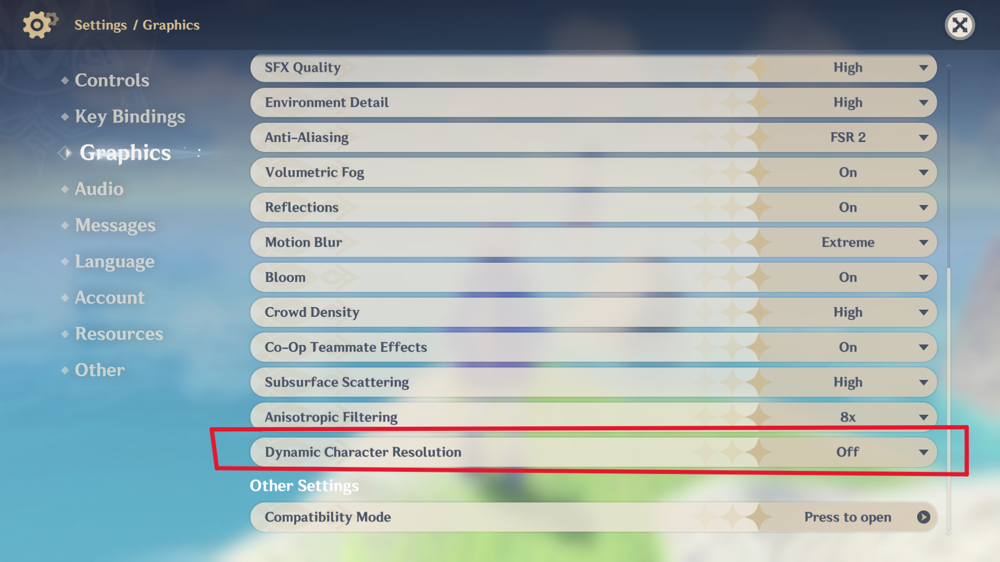
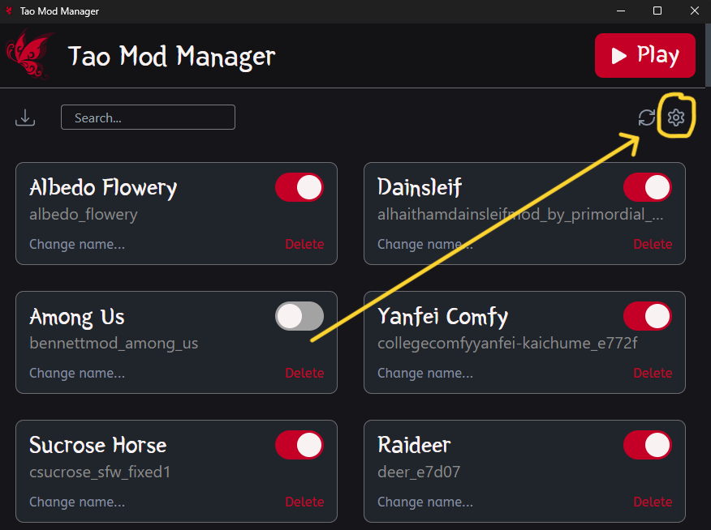
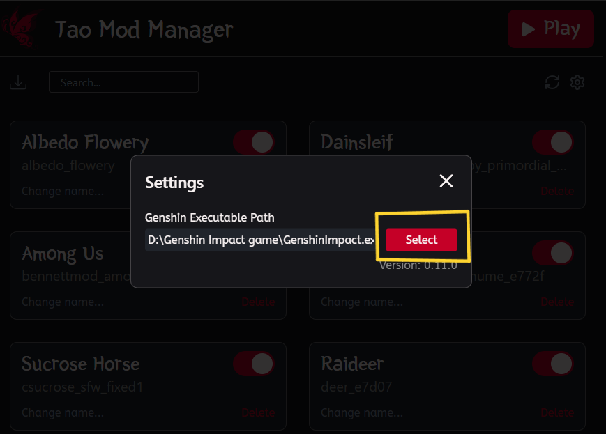
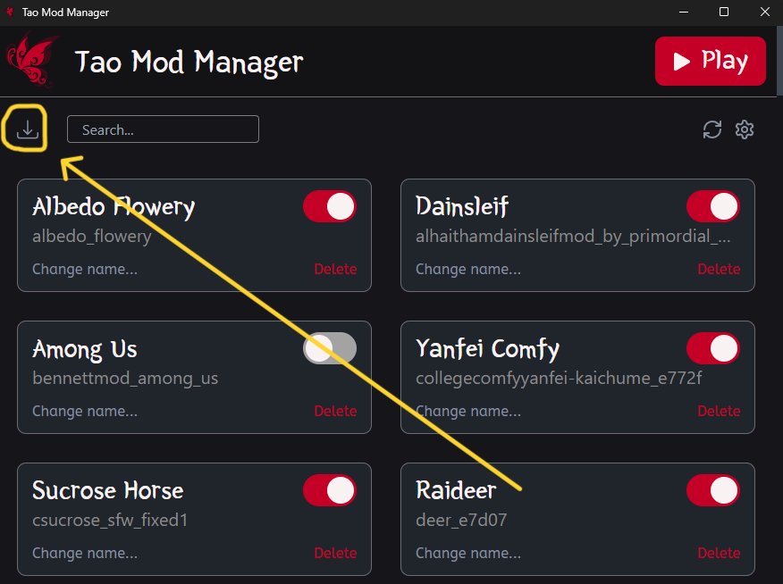
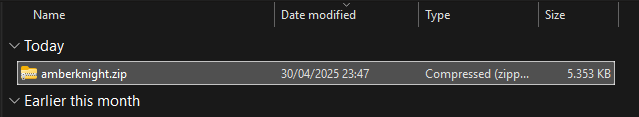
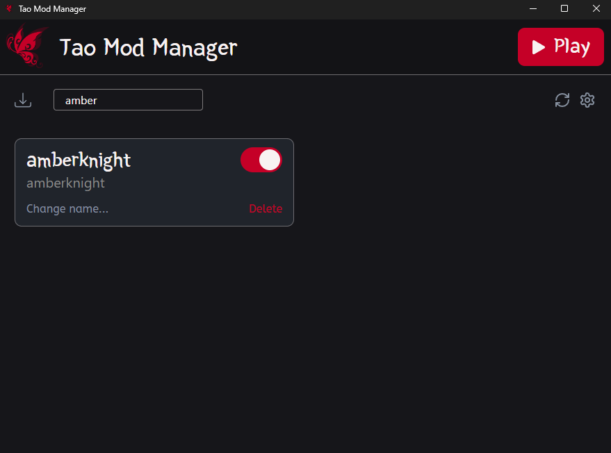
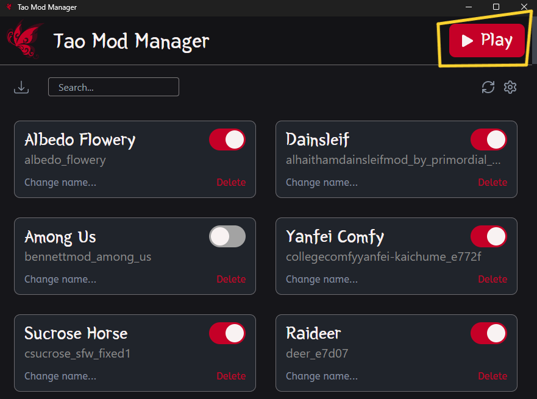
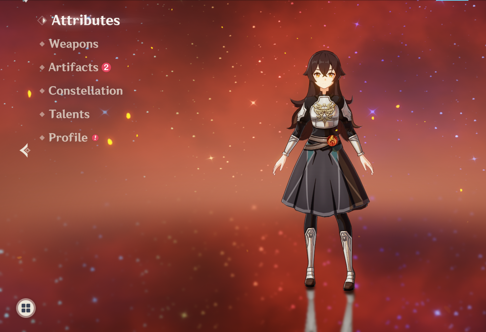
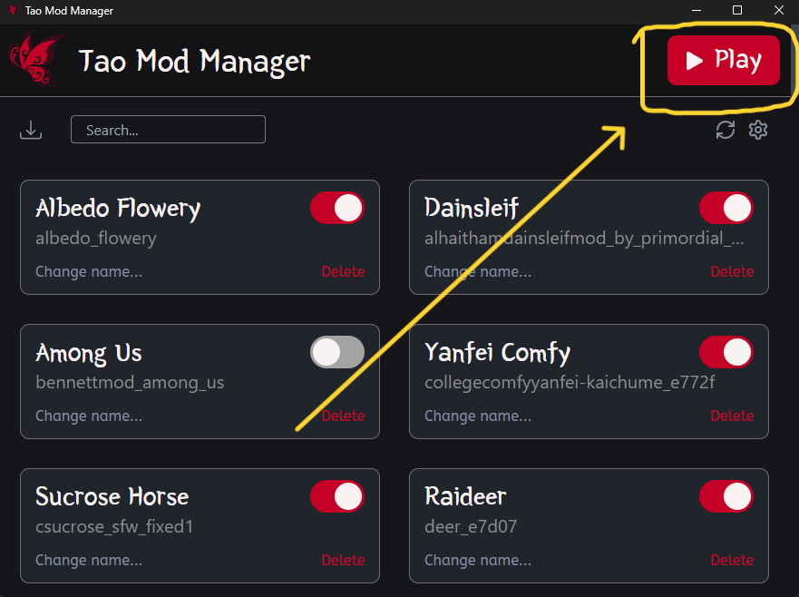

## How to use

Requirements:
- Genshin Impact's game installed
- Tao Mod Manager installed
- Genshin Impact "Dynamic Character Resolution" configuration disabled

### Steps

#### Step 1 - Open Tao Mod Manager

Tao Mod Manager needs admin authorization because needs be able to run Genshin Impact executable.

#### Step 2 - Set your Genshin Impact's executable path in Settings

Now we've to set our Genshin Impact's executable path in settings.

We need open the "settings" section in Tao Mod Manager.

Press "Select" button.

Select your Genshin's Impact executable.

[!TIP]
If you don't know where's your Genshin Impact installed, you can use HoyoMix client to consult the path

#### Step 3 - Import your first Genshin Impact's model

Once you've set your Genshin's path, it's time to import our first model. You can get a lot of models from [GameBanana](https://gamebanana.com/mods/cats/18140). In this example we're gonna use [Knight Amber](https://gamebanana.com/mods/436924) made by [CR00T_R0M](https://gamebanana.com/members/2190560)

When we install the model, we're get a `.zip` file.

Now we import the model in Tao Mod Manager. Just press the **IMPORT** icon in Tao Mod Manager app:

Then we select the `.zip`/`.rar` file:

And we will have the model imported succesfully:

#### Step 4 - Run the App

There's just a "Play" Button at the top rightside of the app:

And our Genshin Impact's game will start with all the models imported.

#### Optional - Fix Skins

Is it your skin bugued? It's a compability error with the models and the latest version of Genshin Impact's renderer. Tao Mod Manager have a way to fix this:

Just pressing this will fix all your **enabled** skins.
